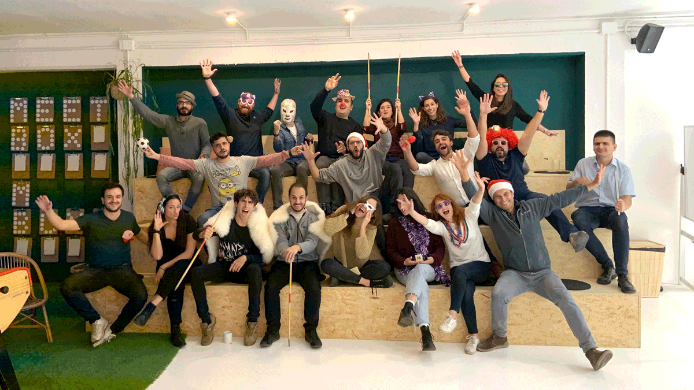
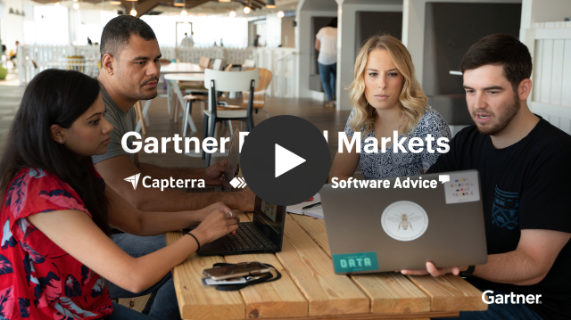

# Join our DevOps team!

We’re a curious, supportive, and high-performing team of professionals that is passionate about creating a culture where every engineer, designer, product manager, and UX researcher gets to make a real impact.

Businesses around the world use [GetApp](https://getapp.com) every day to make the right technology decisions and find the tools they need to grow, optimize, and become more effective at what they do.

If you have a passion for technology and development, a hunger to learn, and a desire to meet challenges, we'd love to get to know you!

GetApp makes up 1/3 of Gartner Digital Markets, with headquarters located in central Barcelona, Spain. 

## How we work:

*   We have flexible hours, you choose when you start and end your day, we do have a daily meeting to update the team on our progress at 10:30 and try not to have any meetings after 17:00.
*   Every week, we **discuss new ideas and topics** that any team member brings to the table. Each proposal opens a new discussion, which eventually leads to changes that **impact and improve our daily work**. **Everyone’s opinion matters.**
*   We like to keep the number of meetings down to a minimum in order to maximize our time to stay focused. However, we do have biweekly **SCRUM meetings** for **planning** or **retrospective,** as well as bimonthly meetings with the **product team**.
*   **Pair programming** and **Code reviews** allow us to make sure we are all on the same page and our work meets our quality standards.

## Who you’ll work with:

2 DevOps Engineers and 15 software engineers in Barcelona, and cloud and security engineers in Gurgaon, Austin, Arlington, and Stamford.

---

At **Gartner Digital Markets**, we go all out when it comes to ensuring your health and happiness. We make it one of our top priorities to give you plenty of reasons to love working here, including a modern approach to work and the best office perks.

## What we offer: 

*   **Limitless growth** and **learning opportunities** — unlimited access to books, videos, and live training with your own [O’Reilly](https://www.oreilly.com/) account, exclusive Gartner research & training, plus opportunities to attend the hottest tech conferences in Europe.  
*   **A collaborative and positive culture** — join a diverse team of creative, friendly and talented professionals that are as smart and driven as you.
*   **A chance to make an impact** — your work will contribute directly to our strategy. 
*   **A modern approach to work** — virtual-first work environment, flexible hours, half-day Fridays, and more.

## What you´ll receive:
* Competitive compensation.
* 23 days annual holiday, and additional days off for your birthday, 24th & 31st of December.
* Private Medical and Dental Care.
* Life and Disability Insurance.
* Public Transport Subsidy.
* Ticket Restaurant Card.
* Childcare Vouchers (Ticket Guarderia).
* IncentiFit - annual reimbursement for health-and-wellness-related activities.
* Pension Scheme.
* Tuition Reimbursement.
* Employee Stock Purchase Plan.
* Employee Assistance Program.
* Gartner Gives Charity Match.
* Relocation Assistance - a specialist to help you with all the appointments and paperwork.

## What is Gartner Digital Markets?

Gartner Digital Markets is made up of the 3 leading B2B software search websites — Capterra, GetApp and Software Advice. Together, our mission is to simplify the way software buyers research and discover the right tools for their business.

We offer the fast pace and excitement of working for a startup, the stability and resources of a large, established organization, and the opportunity to be on the front lines of innovation in an industry that is constantly growing and transforming.

Our fast-growing team is made up of a diverse group of professionals in an actively collaborative environment. We encourage people to take initiative, suggest new ideas, inspire and get inspired in a positive, friendly and productive atmosphere. 

 

**GetApp** HQ: Barcelona, Spain

**Capterra** HQ: Arlington, Virginia, USA

**Software Advice** HQ: Austin, Texas, USA

Visit the [GDM homepage](https://www.gartner.com/en/digital-markets), or check us out on [LinkedIn](https://www.linkedin.com/showcase/gartner-digital-markets/)

## About GetApp:

**Founded**: 2010

**Based in:** Barcelona, Spain

**First office:** Sailboat

**Joined the family:** 2015 

GetApp’s target users are software-savvy buyers who understand the importance of technology, and what it means for the future of their business in an ever-changing environment.  

We provide our users with a proprietary recommendation engine that leverages the combination of user insights and deep technical knowledge to recommend the best software choice. 

Follow us on:

*   [Twitter](https://www.twitter.com/GetApp)
*   [Instagram](https://www.instagram.com/getappcom)
*   [Facebook](https://www.facebook.com/GetAppcom)

